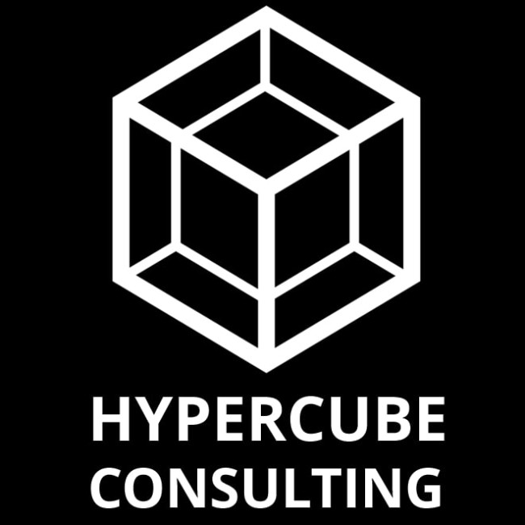

# Using Python with Azure - best practices

This book is a collection of best practices for using Python with Azure. The main reader of this book is a Data Scientist who knows Python and machine learning models and wants to leverage those skills in the cloud using Azure. The book is also useful for a Data Engineer who wants to learn how to use Python to build data pipelines in Azure.



```{tableofcontents}
```
